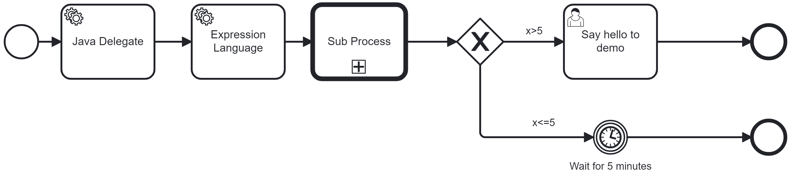
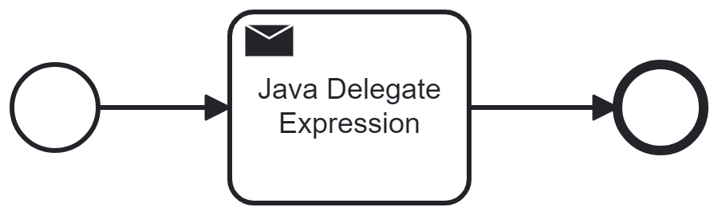
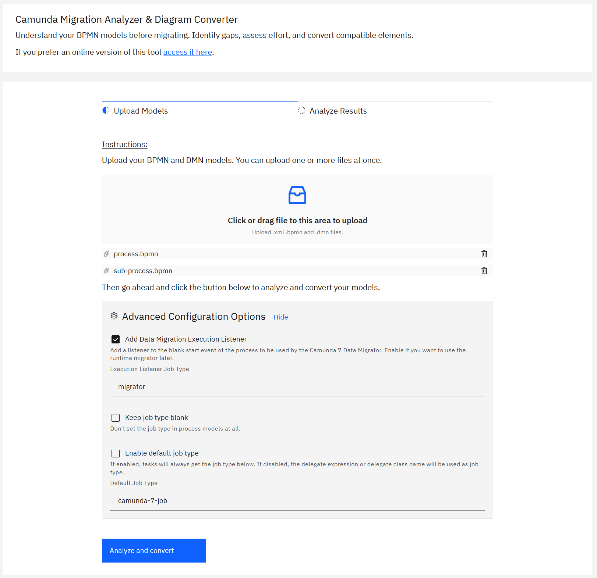
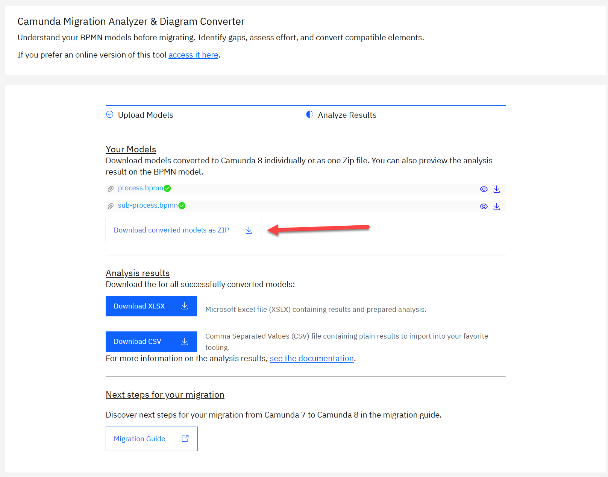
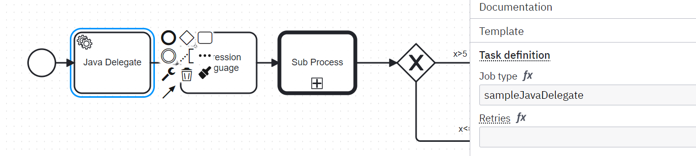
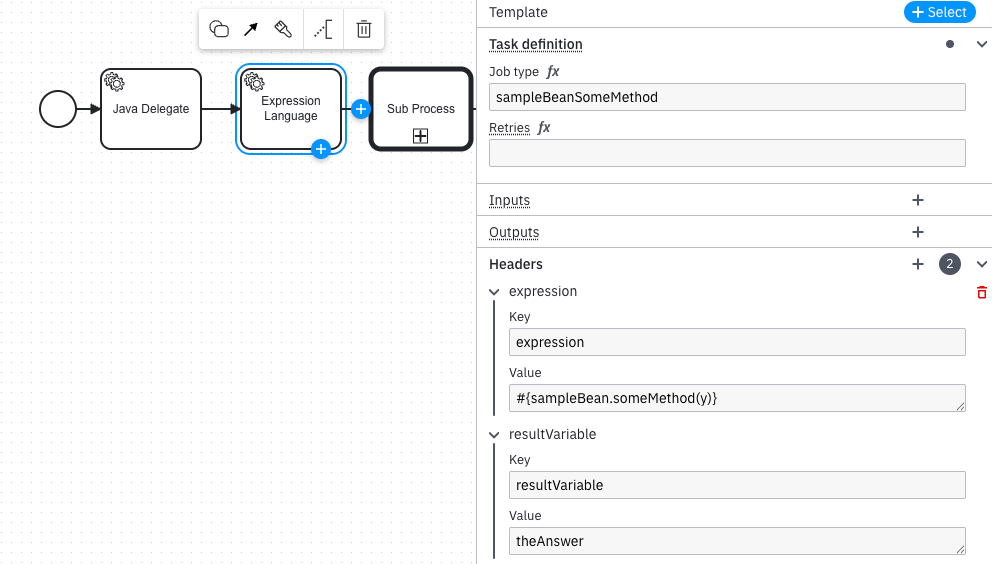
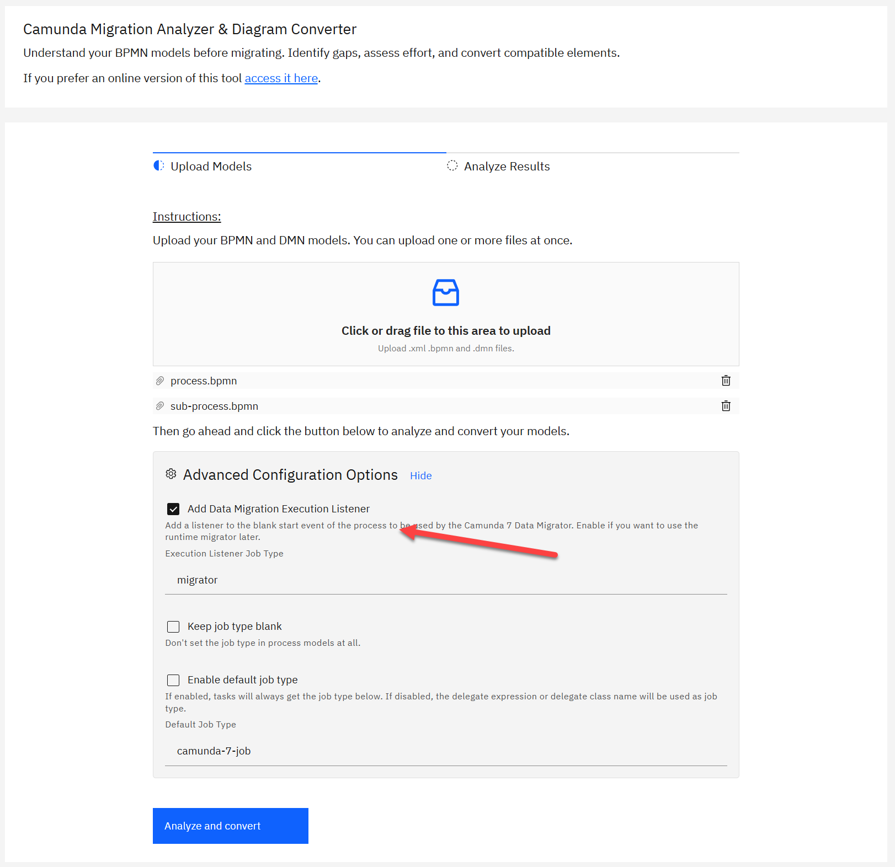
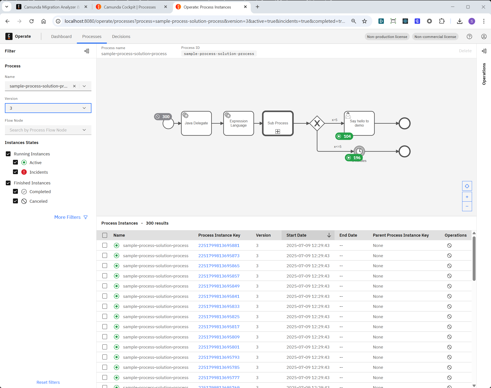

# Camunda 7 to 8 Migration Example

This project contains a simple end-to-end migration example to get a Camunda 7 solution to Camunda 8. It follows the following steps:


1. Existing Camunda 7 solution
2. [Diagram Converter](https://github.com/camunda-community-hub/camunda-7-to-8-migration-analyzer): Convert the BPMN model
3. [Code Conversion with Open Rewrite recipes](https://github.com/camunda-community-hub/camunda-7-to-8-code-conversion/tree/main/recipes)
4. AI-assisted testcase migration based on [testing patterns](https://github.com/camunda-community-hub/camunda-7-to-8-code-conversion/tree/main/patterns/40-test-assertions/10-assertions) (no Open Rewrite recipes yet)
5. [Data Migrator - Runtime Model](https://github.com/camunda/c7-data-migrator/)
6. Done

It is deliberatily simple enough to show migration end-to-end. We know, that most real-life projects are more complex to migrate, still we want to use this as a baseline to discuss the approach and showcase migration tooling.

The [Migration Journey](https://docs.camunda.io/docs/next/guides/migrating-from-camunda-7/migration-journey/) in our migration guide touches on more details.

You can find the **full source code** for this example in this repo:

- [Camunda 7 Process Solution](process-solution-camunda-7/)
- [Migrated Camunda 8 Process Solution](process-solution-camunda-7/)

## The Camunda 7 Process Solution



The process:
- Has a Service Task with Java Delegate Expression: `#{sampleJavaDelegate}`
- Has a Service Task with Expression: `#{sampleBean.someMethod(y)}`
- Calls a sub process
- Uses an XOR gateway with JUEL expressions on the outgoing flows: `#{x>5}` / `#{x<=5}`
- Has a User Task with an assignment to the user `demo`
- Has a timer event with a duration of 5 minutes: `PT5M`

The subprocess:


Code-wise it is a simple Spring Boot application:

```java
@SpringBootApplication
public class Application {
  public static void main(String... args) {
  }
}
```

Here the delegate and Spring bean:

```java
@Component
public class SampleJavaDelegate implements JavaDelegate {
  public void execute(DelegateExecution execution) throws Exception {
    Object x = execution.getVariable("x");
	System.out.println("SampleJavaDelegate " + x);
    execution.setVariable("y", "hello world");
  }
}
@Component
public class SampleBean {
  public int someMethod(String text) {
    System.out.println("SampleBean.someMethod('" + text + "')");
    return 42;
  }
}
```

And of course this project contains a JUnit test case:

```java

@SpringBootTest
public class ApplicationTest {
	
  @Test
  void pathWithUserTask() {
    ProcessInstance processInstance = runtimeService().startProcessInstanceByKey(
            "sample-process-solution-process",
            Variables.createVariables().putValue("x", 7));
    // assert / verify that we arrive in the user task with the name "Say hello to demo"
    assertThat(processInstance).isWaitingAt(findId("Say hello to demo"));
    assertThat(task())
    	.hasName("Say hello to demo")
    	.isAssignedTo("demo");
    
    // complete that task, so that the process instance advances
    complete(task());
    // Assert that it completed in the right end event, and that a Spring Bean hooked into the service task has written the expected process variable
    assertThat(processInstance).isEnded().hasPassed("Event_GreaterThan5");
    assertThat(processInstance).variables().containsEntry("theAnswer", 42);
  }

  @Test
  void pathWithTimer() {
    ProcessInstance processInstance = runtimeService().startProcessInstanceByKey(
                "sample-process-solution-process", //
                Variables.createVariables().putValue("x", 5));
    
    // Query and trigger timmer
    // Execute the pending job (e.g. a timer or async)
    Job timerJob = managementService().createJobQuery()
      .processInstanceId(processInstance.getId())
      .singleResult();
    managementService().executeJob(timerJob.getId());
    
    assertThat(processInstance).isEnded().hasPassed("Event_SmallerThan5");
  }
```

And finally we simulate some load in the system by just starting some process instances on startup:

```java
  public void startSomeProcesses() {
    System.out.println("Let's start some processes to have data in the system...");

    Random random = new Random();
    for (int i = 0; i < 100; i++) {
      int rand = random.nextInt(10); // 0–9

      VariableMap variables = Variables.createVariables();
      variables.putValue("x", rand);

      ProcessInstance processInstance = runtimeService.startProcessInstanceByKey("sample-process-solution-process",
          variables);
      System.out.println("Started " + processInstance.getId());
    }
  }
```

## Migrating the Process Solution to Camunda 8

Let's migrate this solution. We go in multiple steps using various tools on the way.

### Diagram Conversion

1. Convert our BPMN models using the [Migration Analyzer & Diagram Converter](https://github.com/camunda-community-hub/camunda-7-to-8-migration-analyzer):



2. Download the converted models and replace your existing ones:




### Code Conversion

Now run the [Code Convertion - OpenRewrite Recipes](https://github.com/camunda-community-hub/camunda-7-to-8-code-conversion/tree/main/recipes) to refactor your code base. There are not recipes for any situation, but for this case it can already refactor the Camunda client API usage (RuntimeService etc) and the JavaDelegates. Add the following plugin to your pom.xml:

```xml
<project>
    ...
    <build>
        ...
        <plugins>
            ...
            <plugin>
                <groupId>org.openrewrite.maven</groupId>
                <artifactId>rewrite-maven-plugin</artifactId>
                <version>6.0.5</version>
                <configuration>
                    <activeRecipes>
                        <recipe>org.camunda.migration.rewrite.recipes.AllClientRecipes</recipe>
                        <recipe>org.camunda.migration.rewrite.recipes.AllDelegateRecipes</recipe>
                    </activeRecipes>
                    <skipMavenParsing>false</skipMavenParsing>
                </configuration>
                <dependencies>
                    <dependency>
                      <groupId>org.camunda.community</groupId>
                      <artifactId>camunda-7-to-8-rewrite-recipes</artifactId>
                      <version>0.0.1-alpha1</version>
                    </dependency>
                </dependencies>
            </plugin>
        </plugins>
    </build>
</project>
```

and run:

```shell
mvn rewrite:run
```

This will apply a set of refactorings as you can see in the logs:

```log
[INFO] Using active recipe(s) [org.camunda.migration.rewrite.recipes.AllClientRecipes, org.camunda.migration.rewrite.recipes.AllDelegateRecipes]
[INFO] Using active styles(s) []
[INFO] Validating active recipes...
[INFO] Project [process-solution-camunda-7] Resolving Poms...
[INFO] Project [process-solution-camunda-7] Parsing source files
[INFO] Running recipe(s)...
[WARNING] Changes have been made to process-solution-camunda-7\pom.xml by:
[WARNING]     org.camunda.migration.rewrite.recipes.AllClientRecipes
[WARNING]         org.camunda.migration.rewrite.recipes.AllClientPrepareRecipes
[WARNING]             org.openrewrite.java.dependencies.AddDependency: {groupId=io.camunda, artifactId=spring-boot-starter-camunda-sdk, version=8.8.0-alpha4.1}
[WARNING] Changes have been made to process-solution-camunda-7\src\main\java\org\camunda\community\migration\example\SampleJavaDelegate.java by:
[WARNING]     org.camunda.migration.rewrite.recipes.AllDelegateRecipes
[WARNING]         org.camunda.migration.rewrite.recipes.AllDelegatePrepareRecipes
[WARNING]             org.camunda.migration.rewrite.recipes.delegate.prepare.InjectJobWorkerRecipe
[WARNING]         org.camunda.migration.rewrite.recipes.AllDelegateMigrateRecipes
[WARNING]             org.camunda.migration.rewrite.recipes.delegate.migrate.ReplaceExecutionRecipe
[WARNING]                 org.camunda.migration.rewrite.recipes.delegate.migrate.ReplaceExecutionRecipe$CopyDelegateToJobWorkerRecipe
[WARNING]                 org.camunda.migration.rewrite.recipes.delegate.migrate.ReplaceExecutionRecipe$MigrateDelegateVariableHandlingInJobWorker
[WARNING]         org.camunda.migration.rewrite.recipes.AllDelegateCleanupRecipes
[WARNING]             org.camunda.migration.rewrite.recipes.delegate.cleanup.RemoveDelegateRecipe
[WARNING] Changes have been made to process-solution-camunda-7\src\main\java\org\camunda\community\migration\example\SampleProcessStarter.java by:
[WARNING]     org.camunda.migration.rewrite.recipes.AllClientRecipes
[WARNING]         org.camunda.migration.rewrite.recipes.AllClientPrepareRecipes
[WARNING]             org.camunda.migration.rewrite.recipes.client.prepare.AddCamundaClientDependencyRecipe
[WARNING]             org.camunda.migration.rewrite.recipes.sharedRecipes.ReplaceTypedValueAPIRecipe
[WARNING]         org.camunda.migration.rewrite.recipes.AllClientMigrateRecipes
[WARNING]             org.camunda.migration.rewrite.recipes.client.migrate.ReplaceStartProcessInstanceMethodsRecipe
[WARNING]         org.camunda.migration.rewrite.recipes.AllClientCleanupRecipes
[WARNING]             org.camunda.migration.rewrite.recipes.client.cleanup.RemoveEngineDependencyRecipe
[WARNING]             org.openrewrite.java.RemoveUnusedImports
[WARNING] Changes have been made to process-solution-camunda-7\src\test\java\org\camunda\community\migration\example\ApplicationTest.java by:
[WARNING]     org.camunda.migration.rewrite.recipes.AllClientRecipes
[WARNING]         org.camunda.migration.rewrite.recipes.AllClientPrepareRecipes
[WARNING]             org.camunda.migration.rewrite.recipes.client.prepare.AddCamundaClientDependencyRecipe
[WARNING]             org.camunda.migration.rewrite.recipes.sharedRecipes.ReplaceTypedValueAPIRecipe
[WARNING]         org.camunda.migration.rewrite.recipes.AllClientMigrateRecipes
[WARNING]             org.camunda.migration.rewrite.recipes.client.migrate.ReplaceStartProcessInstanceMethodsRecipe
[WARNING]         org.camunda.migration.rewrite.recipes.AllClientCleanupRecipes
[WARNING]             org.openrewrite.java.RemoveUnusedImports
[WARNING] Please review and commit the results.
```

### Review code changes

Let's quickly review the changes.

The JavaDelegate was rewritten to a JobWorker. This follows our patterns:

- [Java Delegate: Class-level Changes](https://github.com/camunda-community-hub/camunda-7-to-8-code-conversion/blob/main/patterns/30-glue-code/10-java-spring-delegate/adjusting-the-java-class.md)
- [Java Delegate: Handling Process Variables](https://github.com/camunda-community-hub/camunda-7-to-8-code-conversion/blob/main/patterns/30-glue-code/10-java-spring-delegate/handling-process-variables.md)

```java
@Component
public class SampleJavaDelegate {

  @JobWorker(type = "sampleJavaDelegate", autoComplete = true)
  public Map<String, Object> executeJobMigrated(ActivatedJob job) throws Exception {
    Map<String, Object> resultMap = new HashMap<>();
    Object x = job.getVariablesAsMap().get("x");
    System.out.println("SampleJavaDelegate " + x);
    resultMap.put("y", "hello world");
    return resultMap;
  }
}
```

As you can see, the job type is set to the former delegate bean name (`sampleJavaDelegate`). This is inline to what the diagram converter did in the BPMN service task:



The client code to start sample processes was also adjusted according to our patterns:

- [Client Code: Class-level Changes](https://github.com/camunda-community-hub/camunda-7-to-8-code-conversion/blob/main/patterns/20-client-code/10-process-engine/adjusting-the-java-class.md)
- [Client Code: Starting Process Instances](https://github.com/camunda-community-hub/camunda-7-to-8-code-conversion/blob/main/patterns/20-client-code/10-process-engine/starting-process-instances.md)
- [Client Code: Handle Process Variables](https://github.com/camunda-community-hub/camunda-7-to-8-code-conversion/blob/main/patterns/20-client-code/10-process-engine/handle-process-variables.md)

```java
  @Autowired
  private CamundaClient camundaClient;

  public void startSomeProcesses() {
    System.out.println("Let's start some processes to have data in the system...");

    Random random = new Random();
    for (int i = 0; i < 100; i++) {
      int rand = random.nextInt(10); // 0–9

      Map<String, Object> variables = new HashMap<>();
      variables.put("x", rand);

      ProcessInstanceEvent processInstance = camundaClient
        .newCreateInstanceCommand()
        .bpmnProcessId("sample-process-solution-process")
        .latestVersion()
        .variables(variables)
        .send()
        .join();
      System.out.println("Started " + String.valueOf(processInstance.getProcessInstanceKey()));
    }
  }
```

Invoking the Spring Bean via JUEL (`#{sampleBean.someMethod(y)}`) requires some extra effort to migrate. The diagram converter moves that expression into an header attribute. Then you can build an own worker doing those JUEL evaluation in your application. It needs to run in your application anyway, as it needs to be able to access your Spring context. This one worker should be able to run all JUEL expressions for you.



A sample [JuelExpressionEvaluatorWorker](process-solution-camunda-8/src/main/java/org/camunda/community/migration/example/el/JuelExpressionEvaluatorWorker.java) is contained in this repository. As you can see, this is relatively straightforward, but the complexity depends on what kind of expressions you need to evaluate.

### Adjusting the Code

You need to add a line of code to your Spring Boot app to auto-deploy process models during startup, a functionality that was automatically enables in Camunda 7, but provides more manual control in Camunda 8:

```java
@SpringBootApplication
@Deployment(resources = "classpath*:/**/*.bpmn")
public class Application {
```


### Cleanup Maven Dependencies

Next up, you should cleanup your Maven dependencies. You can remove all Camunda 7 dependencies, which might also cause changes around the Spring Boot version you are using. In our example - you might simple reduce dependencies to:

```xml
<properties>
  <version.camunda>8.8.0-alpha6-rc3</version.camunda> <!-- used at the time of writing as we need an up-to-date alpha for Camunda Process Test -->
</properties>

<dependencies>
  <dependency>
    <groupId>io.camunda</groupId>
    <artifactId>spring-boot-starter-camunda-sdk</artifactId>
    <version>${version.camunda}</version>
  </dependency>
  <dependency>
    <groupId>io.camunda</groupId>
    <artifactId>camunda-process-test-spring</artifactId>
    <version>${version.camunda}</version>
    <scope>test</scope>
  </dependency> 
  <!-- Used for JUEL evaluation if required -->
  <dependency>
    <groupId>org.glassfish</groupId>
    <artifactId>jakarta.el</artifactId>
    <version>3.0.4</version>
  </dependency>
</dependencies>
```

### Run your Camunda 8 solution

Now we are ready to run our solution against Camunda 8 for the first time, as kind of smoke test. The test cases don't yet compile (see below), but let's ignore this for now. You could [download the latest Camunda 8 Run](https://downloads.camunda.cloud/release/camunda/c8run/) to run Camunda 8 Run locally. For the Data Migrator to work (see below) **you need at least version 8.8-alpha6**. 

Because we added an execution listener for the Data Migrator during the diagram conversion (this is explained in more detail below), you need to add a `noop` job worker to make processes progress out of the start event when they are created in Camunda 8 from scratch:

```java
  @JobWorker(name = "noop")
  public void noop() {
  }
```


When Camunda Run is up propely, you can simply run your Spring application:

```

  .   ____          _            __ _ _
 /\\ / ___'_ __ _ _(_)_ __  __ _ \ \ \ \
( ( )\___ | '_ | '_| | '_ \/ _` | \ \ \ \
 \\/  ___)| |_)| | | | | || (_| |  ) ) ) )
  '  |____| .__|_| |_|_| |_\__, | / / / /
 =========|_|==============|___/=/_/_/_/

 :: Spring Boot ::                (v3.4.7)

Let's start some processes to have data in the system...
Started 2251799813685429
Started 2251799813685439
SampleJavaDelegate 1
Started 2251799813685446
Started 2251799813685453
SampleJavaDelegate 8
SampleJavaDelegate 0
SampleJavaDelegate 3
Started 2251799813685471
SampleJavaDelegate 8
SampleBean.someMethod('hello world')
Started 2251799813685490
SampleBean.someMethod('hello world')
...
```


## Migrating Test Cases

Finally, we also need to migrate the test case. Note that at the time of writing, there were no recipes yet to refactor JUnit test assertions yet.

A possible easy approach is to use Generative AI to refactor the test case, for example starting with a prompt like this: 

```
Please adjust this test case which still uses Camunda 7 assertions to use Camunda Process Test of Camunda 8. You can find some context in https://github.com/camunda-community-hub/camunda-7-to-8-code-conversion/blob/main/patterns/ALL_IN_ONE.md or the official documentation (mostly https://docs.camunda.io/docs/next/apis-tools/testing/assertions/ and https://docs.camunda.io/docs/next/apis-tools/testing/utilities/):

package org.camunda.community.migration.example;
[... add full test case...]
```

In current experiments it requires still a couple of loops to iron out mistakes the AI does - but then you can end up with this test case, which does the same as the Camunda 7 one. Going through that exercise will give you a context in which you would be able to migrate also more than just one test case, but expect a bit of review work.

```java
public class ApplicationTest {

  @Autowired
  private CamundaClient client;

  @Autowired
  private CamundaProcessTestContext processTestContext;

  @Test
  void testHappyPathWithUserTask() {
    // An execution listener was added for the Data Migrator - mock it in our test case. This might be removed once you migrated!
    processTestContext.mockJobWorker("noop").thenComplete(); 

    HashMap<String, Object> variables = new HashMap<String, Object>();
    variables.put("x", 7);

    ProcessInstanceEvent processInstance = client.newCreateInstanceCommand()
      .bpmnProcessId("sample-process-solution-process").latestVersion() //
      .variables(variables) //
      .send().join();

    // assert / verify that we arrive in the user task with the name "Say hello to demo"
    assertThat(processInstance).isActive();
    assertThat(processInstance).hasActiveElements(byName("Say hello to demo"));

    assertThat(UserTaskSelectors.byTaskName("Say hello to demo")) //
      .isCreated()
      .hasName("Say hello to demo")
      .hasAssignee("demo");

    // Using utility method to complete user task found by name
    processTestContext.completeUserTask("Say hello to demo");

    // Assert that it completed in the right end event, and that a Spring Bean hooked into the service task has written the expected process variable
    assertThat(processInstance) //
      .isCompleted() //
      .hasCompletedElements("Event_GreaterThan5");

    // Additional check to verify the expression is working properly
    assertThat(processInstance).hasVariableNames("theAnswer");
    assertThat(processInstance).hasVariable("theAnswer", 42);
  }

  @Test
  void testTimerPath() {
    // An execution listener was added for the Data Migrator - mock it in our test case. This might be removed once you migrated!
    processTestContext.mockJobWorker("noop").thenComplete(); 

    HashMap<String, Object> variables = new HashMap<String, Object>();
    variables.put("x", 5);

    ProcessInstanceEvent processInstance = client.newCreateInstanceCommand()
      .bpmnProcessId("sample-process-solution-process").latestVersion() //
      .variables(variables) //
      .send().join();

    // increase time so that the timer event is triggered and the process moves on
    processTestContext.increaseTime(Duration.ofMinutes(6));
    
    assertThat(processInstance).isCompleted().hasCompletedElements("Event_SmallerThan5");
  }

}
```

This test runs all green - so your process solution is migrated.

## Migrating Runtime Data

With the migration of the solution being successful, let's look at migrating the running instances from Camunda 7 to Camunda 8. This is not required if you slowly drain out Camunda 7, see [Drain Out vs Big Bang](https://docs.camunda.io/docs/next/guides/migrating-from-camunda-7/migration-journey/#drain-out-vs-big-bang).

We are using the [Camunda 7 to 8 Data Migrator](https://github.com/camunda/c7-data-migrator/) for this. Please make sure to check the [Migration Limitations](https://github.com/camunda/c7-data-migrator/tree/main?tab=readme-ov-file#migration-limitations) on what it can do and what it cannot do. For our example, it can migrate all running instances to Camunda 8.

One important prerequisite for the data migrator is, that you need an execution listener with job type `if legacyId then "migrator" else "noop"` on the blank start event of your process:


This can be automatically added by the diagram converter:



Note that this is why we added a mock for it in the test cases:

```java
    // An execution listener was added for the Data Migrator - mock it in our test case. This might be removed once you migrated!
    processTestContext.mockJobWorker("noop").thenComplete(); 
```

The Data Migrator will read from the Camunda 7 database, and talk to the Camunda 8 API. So you have to configure those endpoints in the `config/application.yaml` and of course make sure Camunda 8 is up before running the data migrator. Point the H2 URL to the right database file - or copy it over. Of course you can also configure other database as H2.

```yaml
camunda:
  # Client configuration for connecting to Camunda 8 for runtime migration
  client:
    mode: self-managed
    grpc-address: http://localhost:26500
    rest-address: http://localhost:8080
  migrator:
    job-type: migrator    
    validation-job-type: '=if legacyId then "migrator" else "noop"'
    c7:
      data-source:
        jdbc-url: jdbc:h2:./h2/camunda-h2-database;TRACE_LEVEL_FILE=0;DB_CLOSE_ON_EXIT=FALSE
        ...
```    

With this configured, you can run the data migrator to migrate all running process instances:

```shell
start.bat --runtime
```

You should see some logs, but no errors. Afterwards you can find all instances you started in Camunda 7 earlier in Camunda 8, visible via Camunda Operate:



Note that in a real migration scenario, you typically run the following order:

1. Deploy the process model for migration (including the execution listener for `migrator`)
2. Run the Data Migrator
3. Deploy a process model for production (removing the execution listener for `migrator`)
4. Send production traffic to the system

In the above tutorial, your processes started with application might hang in the start event, if they have the execution listener `migrator` without the Data Migrator running.